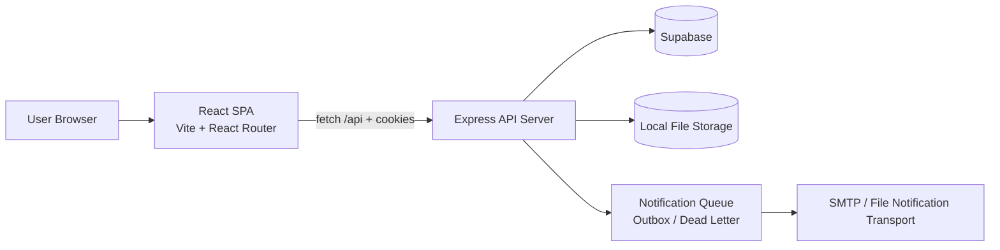
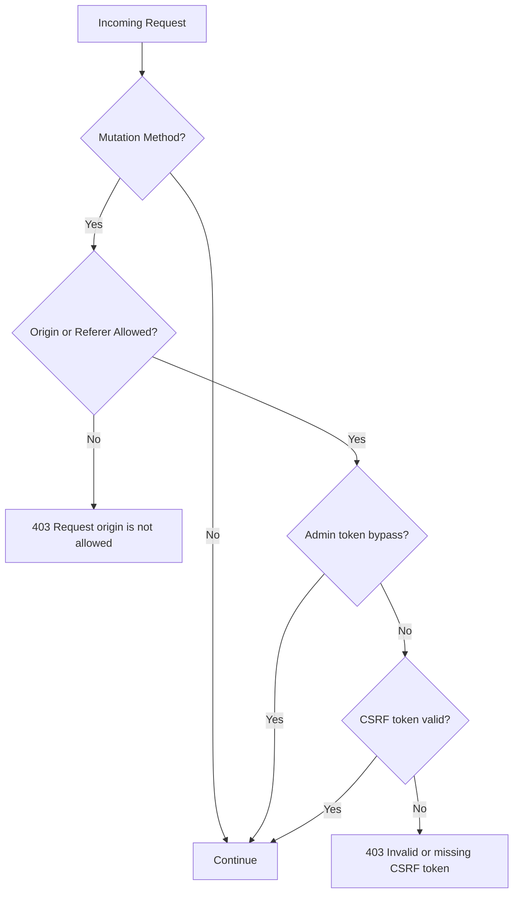
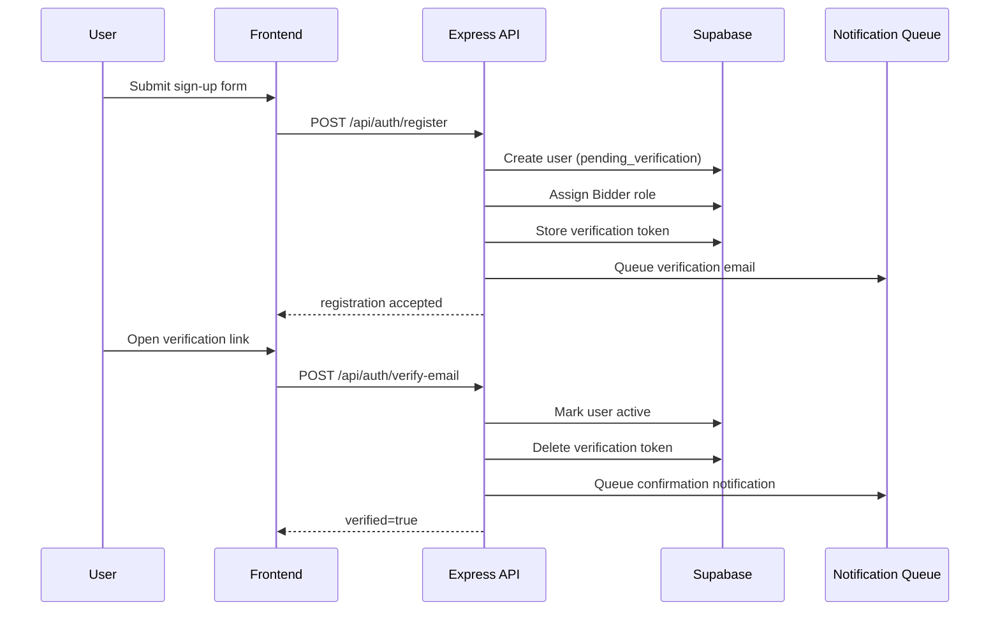
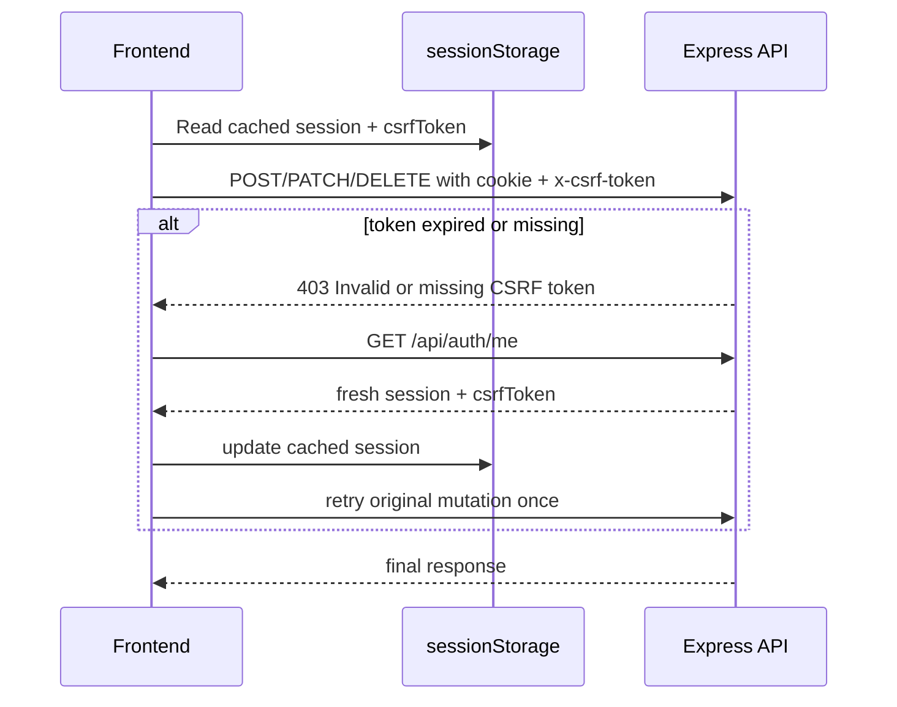
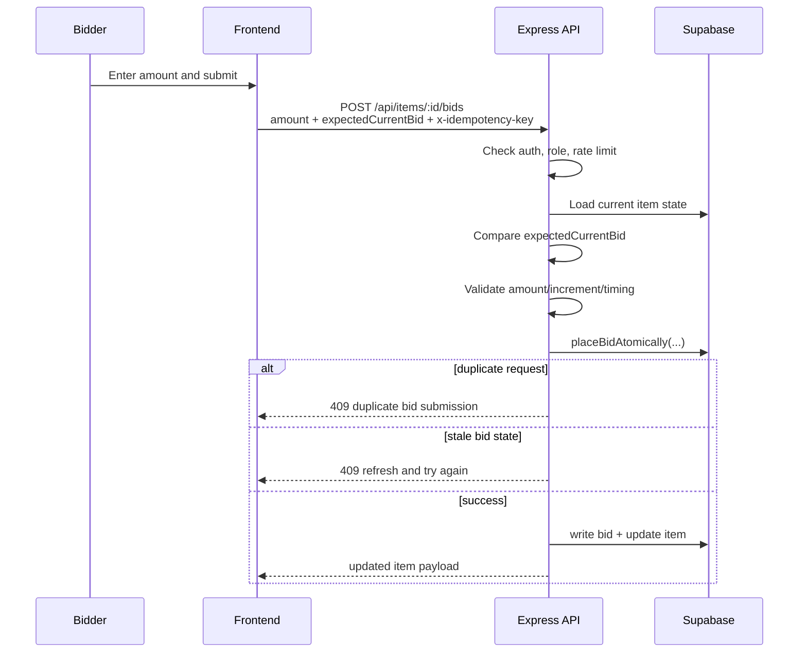
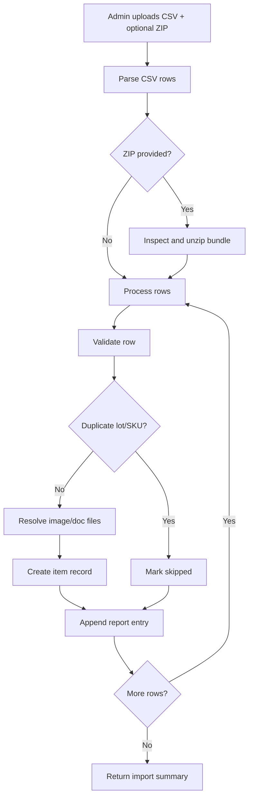

# FMDQ Auctions Project Architecture

## 1. Overview

FMDQ Auctions is a full-stack TypeScript auction platform with:

- A React + Vite frontend for browsing lots, authentication, bidding, dashboards, and admin operations
- An Express backend that handles auth, session management, item CRUD, bidding, notifications, file uploads, and admin workflows
- Supabase used as the primary persistence layer
- Local server-managed storage for uploaded files and notification queue artifacts

The codebase is organized as a single repository containing both the browser app and the API server.

## 2. Stack Summary

### Frontend

- React 18
- TypeScript
- Vite
- React Router DOM
- TanStack React Query
- Tailwind CSS
- Radix UI
- React Hook Form
- Zod
- Zustand
- Sonner

### Backend

- Node.js
- Express
- TypeScript executed via `tsx`
- Multer for multipart uploads
- Nodemailer for email delivery
- Native `crypto` APIs for signing, hashing, and token/session support

### Data and Infrastructure

- Supabase client (`@supabase/supabase-js`)
- File-backed outbox/dead-letter directories under `server/data/`
- Uploaded files stored under `server/uploads/`

### Tooling

- TypeScript strict mode
- Vite React plugin
- Tailwind + PostCSS + Autoprefixer
- Node test runner via `node --test`

## 3. High-Level Architecture

## 4. Repository Layout

### Frontend folders

- `src/main.tsx`: app bootstrap, React Query provider, router, auth provider, toaster
- `src/App.tsx`: route tree and shell composition
- `src/pages/`: route-level pages grouped by `auth`, `auction`, `user`, and `admin`
- `src/components/`: shared UI, layout, route guards, auction widgets
- `src/api/`: frontend API wrappers for auth, items, and admin endpoints
- `src/context/`: auth context and session-derived permissions
- `src/hooks/`: reusable hooks for items, bidding, auth, admin, countdown, inactivity, debounce
- `src/lib/`: API client, formatters, query keys, auth session storage, utility helpers
- `src/store/`: Zustand state
- `src/types/`: shared frontend domain types

### Backend folders

- `server/index.ts`: main API server and almost all backend logic
- `server/worker.ts`: worker entrypoint that boots the same server module in notification-worker mode
- `server/security-logic.ts`: security helpers referenced by the server and tests
- `server/data/`: notification queue, imports, dead-letter persistence
- `server/uploads/`: images, documents, temp files, quarantine

### Supporting folders

- `scripts/`: SQL migration application and migration checks
- `tests/`: API/security tests
- `docs/migrations/`: migration notes

## 5. Frontend Architecture

### App bootstrap

The browser app is initialized in [src/main.tsx](/Users/wksadmin/FMDQ-Auctions/src/main.tsx).

Key responsibilities:

- Creates the React Query client
- Wraps the app in `BrowserRouter`
- Wraps the app in `AuthProvider`
- Registers Sonner toast notifications
- Enables React Query Devtools in development

### Routing model

The route tree is defined in [src/App.tsx](/Users/wksadmin/FMDQ-Auctions/src/App.tsx).

Route groups:

- Public auth pages: `/signin`, `/signup`, `/verify`, `/reset-password`
- Public auction pages: `/`, `/bidding`, `/bidding/:id`, `/closed`
- Authenticated bidder/user pages: `/dashboard`, `/my-bids`, `/won`, `/profile`
- Admin pages: `/admin/items`, `/admin/items/:id`, `/operations`

Route protection:

- `ProtectedRoute` gates signed-in user routes
- `AdminRoute` gates admin-only flows

Layout model:

- `AuthShell` renders auth pages without the main site shell
- `AppShell` renders header, footer, and content outlet once and keeps the shell mounted during navigation

### Data fetching and cache model

The frontend uses React Query as the default async state layer.

Observed behavior from [src/main.tsx](/Users/wksadmin/FMDQ-Auctions/src/main.tsx):

- Query retries are disabled for `401`, `403`, and `404`
- Other queries retry up to 2 times
- `refetchOnWindowFocus` is disabled
- Default `staleTime` is 30 seconds
- Mutations do not retry

### Auth/session model on the client

The auth provider lives in [src/context/auth-context.tsx](/Users/wksadmin/FMDQ-Auctions/src/context/auth-context.tsx).

Important behavior:

- Reads initial session state from browser storage for immediate render
- Refreshes the canonical session from `/api/auth/me`
- Derives role-based flags such as `isAdmin`, `isSuperAdmin`, `canBid`, and `canViewReserve`
- Clears non-auth query cache on sign-out to avoid cross-user stale state

### Frontend API layer

The API wrapper is centralized in [src/lib/api-client.ts](/Users/wksadmin/FMDQ-Auctions/src/lib/api-client.ts).

Important behavior:

- Uses `fetch` with `credentials: "include"` so cookie-based sessions work
- Automatically attaches `x-csrf-token` to mutation requests
- Attempts a session refresh if a signed-in user has no CSRF token cached
- Retries once when the backend responds with `Invalid or missing CSRF token.`
- Throws a typed `ApiError` for non-OK responses

## 6. Backend Architecture

### Server entrypoint

The main server is [server/index.ts](/Users/wksadmin/FMDQ-Auctions/server/index.ts).

Core responsibilities:

- Loads environment values from `.env`
- Validates required backend configuration
- Creates the Express app
- Configures security headers, CORS, JSON parsing, CSRF checks, and request IDs
- Instantiates the Supabase client
- Ensures required directories exist
- Defines the full REST API

### Notification worker mode

[server/worker.ts](/Users/wksadmin/FMDQ-Auctions/server/worker.ts) sets `NOTIFICATION_WORKER_MODE=worker` and then imports `server/index.ts`.

This indicates a shared runtime model:

- API mode
- worker mode
- possibly mixed mode depending on env settings

### Persistence model

The backend appears to use:

- Supabase tables for users, roles, sessions, items, categories, bids, notifications, audits, and related records
- Local disk for uploads and temporary/import assets
- Local outbox/dead-letter files for notification delivery processing

The full database schema is not fully documented in the checked files above, but table usage is visible throughout `server/index.ts`.

## 7. Security Model

Security is a notable part of the project design.

### Controls visible in code

- CORS allowlist derived from `CORS_ORIGINS`
- CSRF protection for mutation requests
- Session cookie handling
- Password hashing
- Signed verification and password reset token flows
- Request origin validation for state-changing requests
- Role-based admin/super-admin enforcement
- Bid rate limiting and auth rate limiting
- Malware scan configuration hooks for uploads
- Request IDs and audit logging
- Strict response headers including CSP, HSTS in production, and no-store caching

### Request protection flow

## 8. API Surface

The server exposes several groups of endpoints.

### Health and session

- `GET /api/health`
- `GET /api/auth/me`
- `POST /api/auth/logout`

### Authentication

- `POST /api/auth/register`
- `POST /api/auth/login`
- `POST /api/auth/verify-email`
- `POST /api/auth/resend-verification`
- `POST /api/auth/request-password-reset`
- `POST /api/auth/reset-password`

### User self-service

- `GET /api/me/profile`
- `GET /api/me/sessions`
- `DELETE /api/me/sessions/:id`
- `DELETE /api/me/sessions`
- `GET /api/me/dashboard`
- `GET /api/me/bids`
- `GET /api/me/wins`

### Auction browsing and bidding

- `GET /api/items`
- `GET /api/items/:id`
- `POST /api/items/:id/bids`
- `GET /api/categories`

### Admin item/category/export operations

- `POST /api/categories`
- `DELETE /api/categories/:name`
- `POST /api/items`
- `PATCH /api/items/:id`
- `DELETE /api/items/:id`
- `POST /api/items/:id/restore`
- `POST /api/items/bulk-import`
- `GET /api/exports/items.csv`
- `GET /api/exports/audits.csv`

### Admin user/ops functions

- `GET /api/admin/operations`
- `GET /api/admin/audits`
- `GET /api/admin/notifications`
- `POST /api/admin/notifications/process`
- `GET /api/admin/users`
- `GET /api/admin/roles`
- `POST /api/admin/users/:id/roles`
- `DELETE /api/admin/users/:id/roles/:roleName`
- `POST /api/admin/users/:id/disable`
- `POST /api/admin/users/:id/enable`
- `POST /api/admin/users/:id/password-reset`
- `POST /api/admin/users/password-resets`
- `POST /api/admin/users/bulk-import`

### File serving

- `GET /uploads/images/:file`
- `GET /uploads/documents/:file`

## 9. Core Business Flows

### 9.1 User registration and verification

Observed from [server/index.ts](/Users/wksadmin/FMDQ-Auctions/server/index.ts):

1. User submits display name, email, and password.
2. Backend rate-limits the attempt.
3. Password strength is validated.
4. A new user is created in Supabase with `pending_verification`.
5. A default `Bidder` role is assigned.
6. An email verification token is created.
7. A notification is queued.
8. An audit entry is recorded.
9. User verifies email with token.
10. Account is switched to `active`.

### 9.2 User sign-in and session establishment

1. Frontend posts credentials to `/api/auth/login`.
2. Backend validates rate limit, password, and account state.
3. Backend creates a session record and session cookie.
4. Backend derives user role and returns session payload plus CSRF token.
5. Frontend stores a session snapshot and uses it for protected UI.

### 9.3 Authenticated mutation flow with CSRF

### 9.4 Browse auction items

1. Public or authenticated user loads bidding pages.
2. Frontend fetches `/api/items` or `/api/items/:id`.
3. The route/page components render auction details, gallery, documents, and bid state.

### 9.5 Place a bid

Observed from the bid route:

1. User must be signed in.
2. Role must allow bidding.
3. Bid rate limiting is enforced.
4. The item is loaded.
5. The client-supplied `expectedCurrentBid` is compared against server state.
6. Bid amount is validated.
7. Bid is placed atomically.
8. Duplicate submissions are checked via idempotency key.
9. Audit logging occurs.

### 9.6 Admin item creation/update/archive/restore

Admin item flows support:

- Multipart image uploads
- Multipart document uploads
- Category upsert
- Audit logging
- Notification queueing
- Soft archive and restore behavior

### 9.7 Bulk item import

Observed behavior:

1. Admin uploads a CSV.
2. Optional ZIP bundle may contain image/document assets.
3. Server validates the archive before extraction.
4. Rows are parsed and normalized.
5. Existing items are detected by lot or SKU.
6. Files are mapped from extracted assets to row metadata.
7. Each item is created or skipped/failed with a per-row report.
8. A final bulk import report is returned.

### 9.8 Notification processing

The codebase uses a queue/outbox pattern for notifications. The worker entrypoint suggests that notification processing can run independently from the main API process.

Likely lifecycle:

1. API action queues a notification.
2. Notification is stored in DB and/or file-backed outbox artifacts.
3. Worker or API processing loop claims due jobs.
4. Delivery is attempted through configured transport.
5. Failures can move to dead-letter storage after retry exhaustion.

## 10. Runtime and Environment

The backend expects several important environment variables. Based on `server/index.ts`, notable ones include:

- `NODE_ENV`
- `PORT`
- `APP_BASE_URL`
- `APP_SECRET`
- `SUPABASE_URL` or `NEXT_PUBLIC_SUPABASE_URL`
- `SUPABASE_SERVICE_ROLE_KEY`
- `ADMIN_API_TOKEN`
- `ENABLE_ADMIN_API_TOKEN`
- `CORS_ORIGINS`
- `NOTIFY_TO`
- `NOTIFY_TRANSPORT`
- `NOTIFICATION_WORKER_MODE`
- `SMTP_HOST`
- `SMTP_PORT`
- `SMTP_USER`
- `SMTP_PASS`
- `SMTP_FROM`
- `SMTP_SECURE`
- `SUPABASE_IMAGE_BUCKET`
- `SUPABASE_DOCUMENT_BUCKET`
- `IMAGE_ACCESS_POLICY`
- `MALWARE_SCAN_MODE`
- `MALWARE_SCAN_COMMAND`
- `OPS_ALERT_WEBHOOK_URL`
- `ERROR_WEBHOOK_URL`

Required backend minimum:

- Supabase URL
- Supabase service role key
- App secret

## 11. File and Upload Handling

Upload behavior visible from the backend:

- Images and documents are accepted for item creation and update
- Temporary upload locations exist
- Quarantine support exists
- Malware scanning can be enabled by configuration
- Bulk imports can include ZIP archives that are extracted to temp directories
- Served files are exposed through `/uploads/images/:file` and `/uploads/documents/:file`

## 12. Testing

The current test suite includes:

- Security and CSRF-related tests
- Basic API route behavior tests

Observed in [tests/api-routes.test.ts](/Users/wksadmin/FMDQ-Auctions/tests/api-routes.test.ts):

- Anonymous `GET /api/auth/me` behavior
- Safe logout behavior
- Rejection of untrusted origins
- Rejection of mutations without origin/referer
- CSRF validation on logout
- Anonymous access denial for admin restore and bidding

## 13. Build and Run Commands

From `package.json`:

- `npm run dev`: start frontend Vite dev server
- `npm run build`: production frontend build
- `npm run preview`: preview built frontend
- `npm run typecheck`: TypeScript checking
- `npm run dev:server`: run Express API in TS mode
- `npm run dev:worker`: run notification worker entrypoint
- `npm run db:migrate`: apply SQL migrations
- `npm run db:deploy`: run migrations and required migration checks
- `npm test`: execute Node-based tests

## 14. Suggested Mental Model

If you are onboarding to this project, think of it as:

- A React SPA for user and admin workflows
- Backed by a security-conscious Express API
- Using Supabase as the primary data store
- With server-owned auth/session management rather than frontend-only auth
- And a queue-driven notification subsystem that can run in worker mode

## 15. Known Documentation Gaps

This document is based on the current repository contents and code inspection. A few areas would benefit from a dedicated follow-up doc if you want deeper operational detail:

- Full database schema and table relationships
- Exact notification queue persistence strategy
- Deployment architecture and hosting topology
- Detailed role matrix for all permissions
- End-to-end API request/response contracts by route

## 16. Recommended Next Docs

If you want a more complete documentation set, the next most useful files would be:

1. `docs/api-reference.md`
2. `docs/database-schema.md`
3. `docs/security-model.md`
4. `docs/deployment-runbook.md`
5. `docs/onboarding-guide.md`
